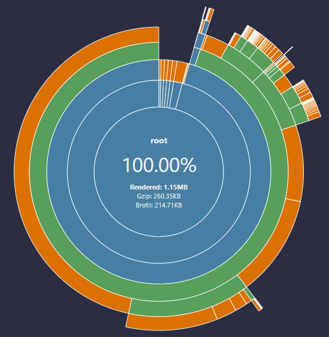
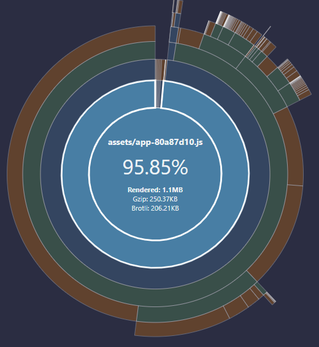
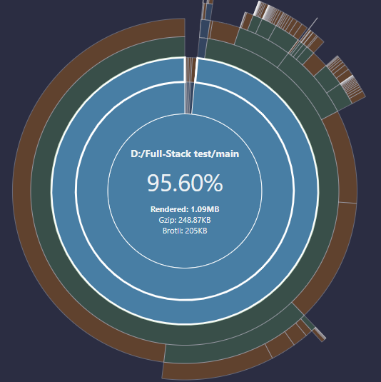
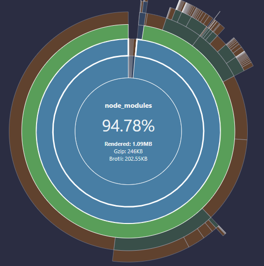
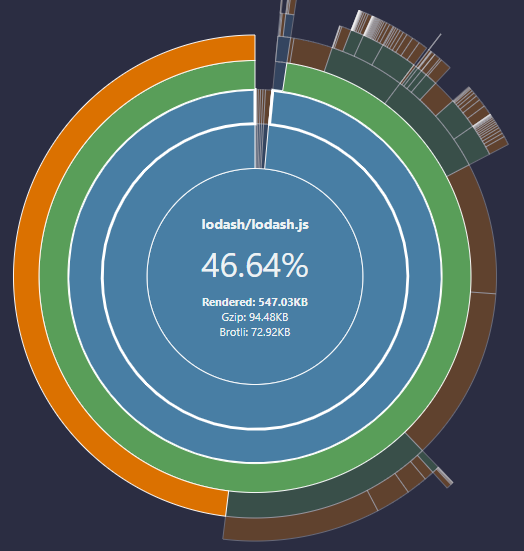
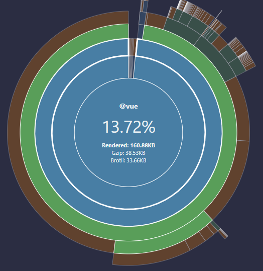

# Restaurant Menu 
Restaurant menu that contains categories, subcategories and items with supporting discounts

## Technical Description
    Laravel 9
    VueJs 3
    Laravel/breeze
    Vuex 4
    Vue-loader
    Vue-router
    Vite
    Inertiajs

## Installation
1. git clone
2. Copy .env.example file to .env with your database credentials
3. composer install
4. php artisan key:generate
5. php artisan migrate
6. npm install

## Usage
1. npm run dev
2. php artisan serve

## Bundle Analyz Visualizer

